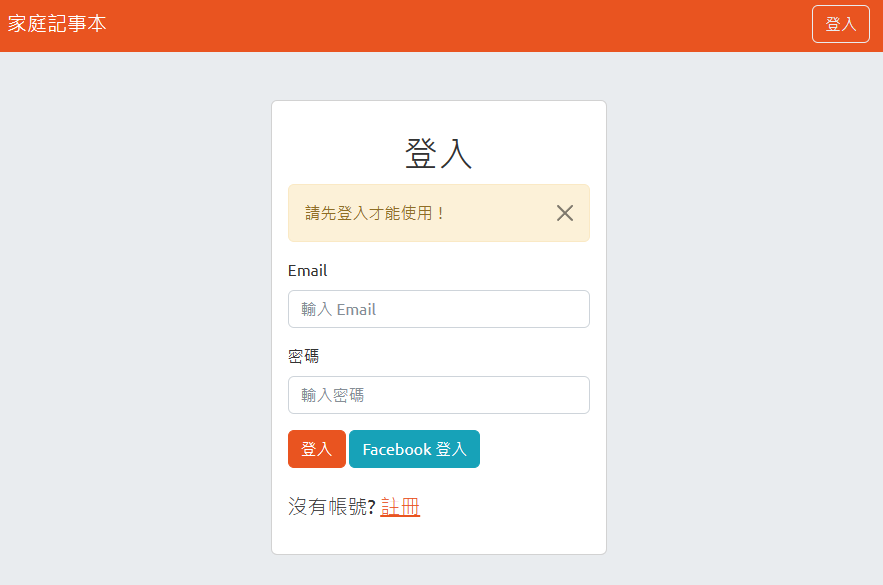
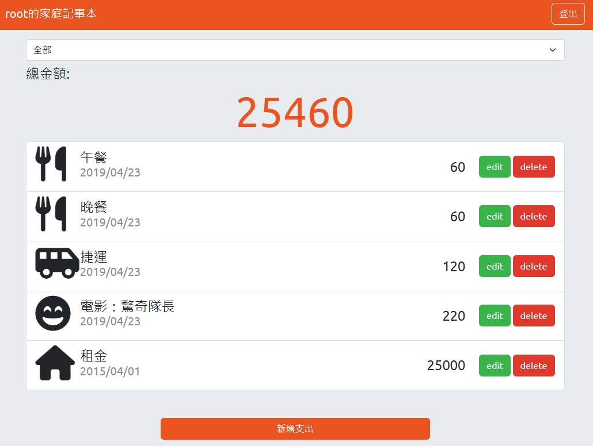

# 家庭記事本

## 介紹
透過註冊帳號並記錄自己的花費紀錄，可以編輯、新增、刪除紀錄，並計算出總花費




### 功能
1. 需要註冊帳號並登入後才能使用
2. 支援 Facebook 登入
3. 新增紀錄
4. 編輯紀錄
5. 刪除紀錄
6. 計算總花費

## 環境建置
1.  Node.js
2.  Express 4.16.4
3.  Express-Handlebars 3.0.0
4.  mongoose 5.9.7
5.  bcryptjs 2.4.3
6.  connect-flash 0.1.1
7.  express-session 1.17.1
8.  method-override 3.0.0
9.  passport 0.4.1
10. passport-facebook 3.0.0
11. passport-local 1.0.0

## Installing - 專案安裝
1. 將專案放到你的電腦，用終端機進入資料夾
2. 安裝 npm 套件
```
npm install
```

3. 設定環境變數，項目請參考.env.example，新建一個 .env 檔案，使用你的 MongoDB ，設定 MONGODB_URL 環境變數
```
MONGODB_URL=mongodb+srv://<username>:<password>@<cluster>.pk4dwnp.mongodb.net/?retryWrites=true&w=majority
```

4. 製作預設使用者的紀錄
```
npm run seed
```

5. 啟動伺服器
```
npm run dev 
```

6. 當 terminal 出現以下字樣，表示伺服器已啟動並成功連結
```
App is running in http://localhost:3000
```
7. 打開瀏覽器輸入 http://localhost:3000 進入網頁

8. 使用 Ctrl + c 結束